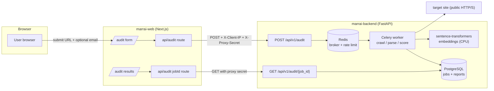

# Marrai Backend

Marrai Backend is the FastAPI service behind Marrai's free Answer Engine Optimization (AEO) audit.

It accepts a website URL, crawls pages from the same domain, extracts machine-readable signals, runs deterministic and semantic scoring, and returns a structured audit report that the frontend displays.

## What is Marrai?

Marrai helps website owners understand whether AI answer engines can understand, retrieve, and cite their website. Traditional SEO focuses on search engine rankings; Marrai focuses on answer-engine readability — the signals that help AI systems parse, summarize, compare, and cite a website.

## Features

* FastAPI audit API (`/api/v1/audit`)
* Async same-domain crawling (up to 20 pages per audit by default)
* Static HTML, metadata, heading hierarchy, schema, canonical, and internal-link extraction
* Deterministic scoring across AEO categories + embedding-based semantic alignment scoring
* SSRF protection on every redirect hop (DNS classification, http/https only, port allow-list, no credentials)
* Background job processing with Celery, Redis broker, PostgreSQL persistence, Alembic migrations
* IP-based rate limiting (fail-open) with `429` + `Retry-After`
* Proxy trust boundary: the Next.js frontend forwards `X-Client-IP` with `X-Proxy-Secret`; a missing secret is rejected with `403`
* Optional completion email via Resend (never fails an audit)
* Fail-soft boot: unavailability of PostgreSQL/Redis at startup degrades `/ready` instead of crashing the container
* Docker + Docker Compose (development and production), fail-soft boot

## Architecture



## Scoring categories

* **Metadata** — titles, meta descriptions, canonical URLs, robots signals
* **Content quality** — headings, word count, body text, content structure
* **Structured data** — schema presence/types, FAQ-style structured data
* **Connectivity** — internal links and crawlability
* **Technical compliance** — image alt text and machine-readable hygiene
* **Semantic clarity** — embeddings compare headings with the content beneath them

Overall and per-category scores are `0–100`, shared with the frontend score bands (`80` strong, `65` good, `40` needs improvement).

## API endpoints

| Method | Path | Purpose |
| --- | --- | --- |
| `GET` | `/health` | Liveness (always 200 when the process is up) |
| `GET` | `/ready` | Readiness (reports `database` / `redis` connectivity, does not crash when infra is down) |
| `POST` | `/api/v1/audit` | Create an audit job |
| `GET` | `/api/v1/audit/{job_id}` | Poll job status / fetch report |

Job statuses: `pending`, `started`, `crawling`, `scoring`, `success`, `failure`.

```bash
curl -X POST "http://localhost:8000/api/v1/audit" \
  -H "Content-Type: application/json" \
  -d '{"url": "https://example.com", "email": "user@example.com"}'
```

```json
{ "job_id": "uuid-string", "status": "pending" }
```

`email` is optional. `JobResponse` never echoes the email back.

## Local development (Docker)

```bash
cp .env.example .env
docker compose up --build
```

This starts the API, Celery worker, PostgreSQL, Redis, and the Alembic migrator.

```bash
curl http://127.0.0.1:8000/health
```

Production-compose variant:

```bash
cp .env.example .env.production
# fill in real secrets, then:
docker compose -f docker-compose.production.yml up -d --build
```

For local development leave `API_PROXY_SHARED_SECRET` empty. In production set it to `openssl rand -hex 32` and mirror it in the frontend's `API_PROXY_SHARED_SECRET`, otherwise API requests are rejected.

## Running without Docker

```bash
python -m venv venv && source venv/bin/activate
pip install -r requirements.txt
uvicorn main:app --reload
```

This mode needs PostgreSQL and Redis reachable at the configured URLs, plus `alembic upgrade head` run once.

## Database migrations

```bash
alembic upgrade head      # apply
alembic revision -m "…"   # new migration
```

## Testing

```bash
pytest -v
```

The suite covers the API, SSRF/security classification, crawler behavior, rate limiting, scoring, and report serialization. It uses a fake Redis and does not require infra.

## Environment variables

See `.env.example` (documented inline). Highlights:

| Variable | Purpose |
| --- | --- |
| `DATABASE_URL` / `DB_*` | PostgreSQL connection |
| `REDIS_URL` | Celery broker + rate limiting |
| `FRONTEND_URL` | Public frontend origin (report links in emails, default CORS) |
| `CORS_ORIGINS` | Extra CORS origins |
| `API_PROXY_SHARED_SECRET` | Proxy trust secret (production) |
| `RATE_LIMIT_WINDOW_SECONDS` / `RATE_LIMIT_MAX_REQUESTS` | Audit rate limit per IP `(3600s / 5)` |
| `CRAWL_*`, `USER_AGENT` | Crawler behavior/timing |
| `EMBEDDING_MODEL` | sentence-transformers model id |
| `RESEND_API_KEY` / `RESEND_FROM_EMAIL` | Optional completion email |
| `APP_ENV` | `development` or `production`; production validates insecure defaults |

## Frontend connection

The frontend (`marrai-web`) calls the backend only through Next.js server routes that add `X-Client-IP` and `X-Proxy-Secret`. Browsers never talk to the backend directly.

Expected local API URL: `http://localhost:8000` (browser-safe CORS origin: `http://localhost:3000`).

## Manual deployment (no CI/CD)

This is a hobby project, so deployment is intentionally manual — one server box, one command per service.

```bash
# 1. Build the local image once
docker build -t marrai-backend:latest .

# 2. Fill in real production secrets
cp .env.example .env.production   # edit: DATABASE_URL, REDIS_URL, APP_ENV=production,
                                  #       API_PROXY_SHARED_SECRET, FRONTEND_URL, RESEND_API_KEY

# 3. Run the production topology (API + worker + Redis). Postgres is expected
#    to be a hosted/managed instance referenced by DATABASE_URL.
export BACKEND_IMAGE=marrai-backend:latest
docker compose -f docker-compose.production.yml up -d
```

Deploying the frontend is the same idea: `pnpm build` once, serve the output (e.g. `next start` behind a reverse proxy) with `BACKEND_API_URL`, `API_PROXY_SHARED_SECRET`, and `NEXT_PUBLIC_SITE_URL` set.

On a fresh server, re-run the build steps and `docker compose up -d` after pulling the repo — that is the whole pipeline.